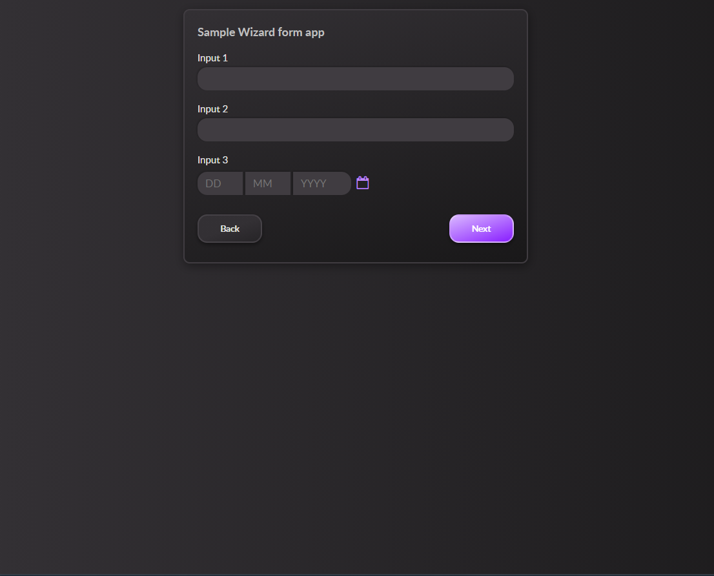

# DT Frontend Code Challenge

### Intro

The objective of the DT frontend code challenge is to create a UI which matches as closely as possible the [example](example.png) image:



The code challenge UI you create should consist of static html and CSS/LESS updates to the files included in the repo.

To run the code challenge you will need a version of node installed >=12.0.0.

Getting started
---------------

### Initial setup

Fork this repo then run the following commands in a terminal at the repo root:

```bash
npm install
```

This will install all the dependencies required to run the code challenge.

### Run the local server

```bash
npm run dev
```

Then navigate to [http://localhost:3000](http://localhost:3000) in your browser.

### Updates

Add all html markup updates to the index.html file. For CSS updates add selectors to styles.less. If you're unfamiliar with CSS  preprocessors don't worry, you can use standard CSS in the styles.less file. The code challenge uses [Vite](https://vitejs.dev/) for frontend tooling. When running in dev mode all files will be hot reloaded.

